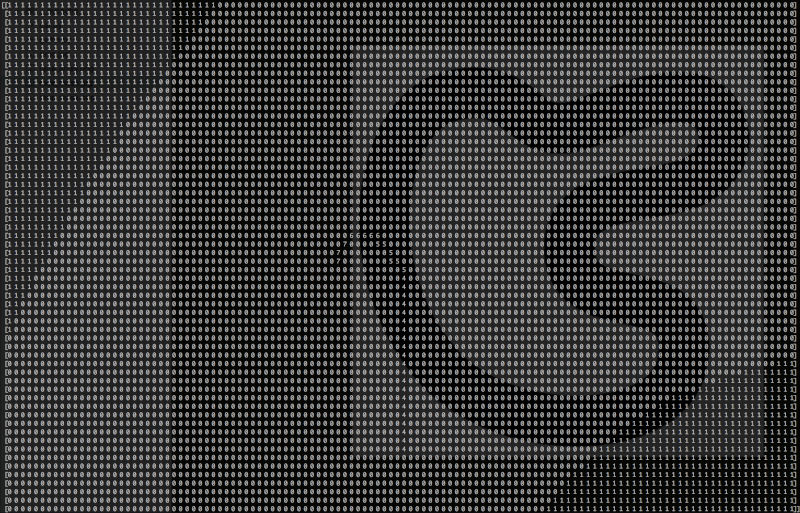

# Cars evolution with a neural network

## Cars:
```python
Car(object):
  def __init__(self, v = 0, a = 0, rr = 0):
    self.v     = v     # velocity, moves per second
    self.a     = a     # acceleration (+) or slowing down (-), [-1..1]
    self.rr    = rr    # rolling resistance, [0..1]
    self.stuck = False # stuck or free to move
```

## NN input:
```python
# d - for distance looking in a particular direction (angle)
{ d(-pi/2), d(-pi/4), d(0), d(pi/2), d(pi/2) }
```

## NN output:
```python
{ acceleration, steer }
```

## A sample racing map


## The results:

