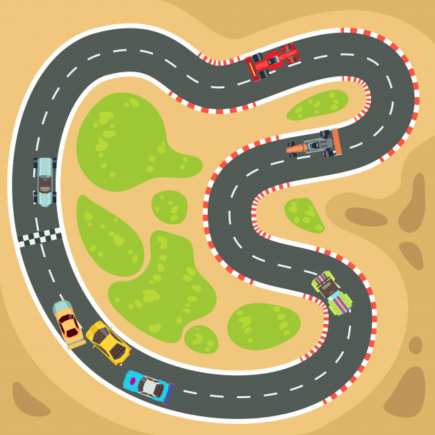
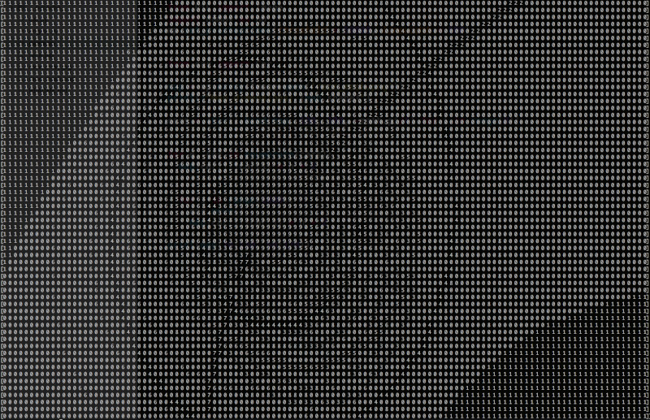

# Cars evolution with a neural network

## Cars:
```python
class Car(object):
  def __init__(self, v=0, a=0, s=0, rr=0.1):
    self.v     = v     # velocity, moves per second
    self.a     = a     # acceleration (positive) or slowing down (negative); a ∈ R[-1..1]
    self.s     = s     # steer left (negative) or right (positive); s ∈ R[-1..1]
    self.rr    = rr    # rolling resistance; rr ∈ R[0..1]
    self.stuck = False # stuck or free to move
    self.engine = Engine()
```

## NN input:
```python
# d - for distance looking in a particular direction (angle)
{ d(-pi/2), d(-pi/4), d(0), d(pi/2), d(pi/2), velocity }
```

## NN output:
```python
{ acceleration, steer }
```

## A sample racing map



## The results:

We have launched 8 cars (numbered 2 to 9):

